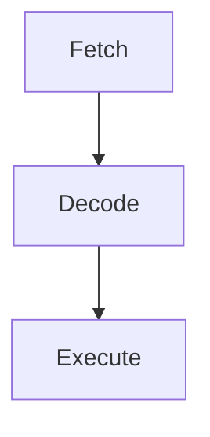

# Systems Hardware:

## CPU Architecture 1.1.1:

---

### Main Components:

- Control Unit
- Arithmetic and Logic Unit
- Main Memory
- Cache
- Registers
    - Program Counter
    - Current instruction register
    - Accumulator
    - Memory address register
    - Memory data register

>[!info] **CPU - The part of the computer in charge of managing data, executing programs and controlling hardware**
>
## Control Unit:

The control unit organises the execution of the instruction and manages other components in the CPU. 

It is responsible for: 

- Instructions execution control
- Decoding CPU Processes for it to execute
- Sends & receives signals for controlling other components

## Arithmetic Logic Unit (ALU):

The ALU is in charge of carrying out: 

- Arithmetic Calculations: Addition, Subtraction, Division and Multiplication
- Logical Operations: `AND, OR, NOT`
- Value Comparisons: >, <, =

## Registers:

Registers are locations of computer memory within the CPU, that have extremely fast access. 

General purpose register are used to keep intermediate calculation responses that are part of a large computation. 

Dedicated Registers 

| Register  | Purpose |
| --- | --- |
| Current Instruction Register  | Holds onto instructions that are in the process of being executed  |
| Memory Address Register | Temporarily stores addresses whilst searching RAM  |
| Memory Data Register  | Temporarily holds data that needs to be written to the main memory  |
| Program Counter  | Holds address of instructions that are waiting to be executed  |
| Accumulator  | Stores calculation results |

## Fetch, Decode, Execute Cycle:

Fetch: 

Each instruction is needed to be fetched from the main and put into the appropriate registers

Decode: 

The processor decodes the binary instructions it receives 

Execute: 

The Control Unit tells the components what they have to do and the process is then executed. 

## Von Neumann Architecture:

---

In the 1940’s, John von Neumann and his team developed a computer with the a concept of a stored program system. Data and program instructions would be stored on main memory and moved to and from from the processor. 

This architecture consisted of: 

- A processor
- A memory unit
- Connections for I/O
- Secondary storage for data backup

# Factors that Affect CPU performance (1.1.2):

---

## Cache:

> [!info] Definition
> Cache- High speed memory, that sits close to or even directly on the CPU; it is used to store instructions and frequently used data.
> 

When running programs, a computer system is swapping data in and out of cache & RAM constantly. When a set of instructions or a single instruction is frequently used, it is more efficient to store it on cache then to have to fetch it each time. Same as RAM: Cache is volatile and all data is wiped when power is lost. 

## Number of Cores:

Computers with CPU’s that have more than one core are known as multicore processor computers. 

- Dual-Core-   2 CPU Cores
- Quad-Core- 4 CPU Cores
- Hexa-Core - 6 CPU Cores
- Octo-Core - 8 CPU Cores

Usually, the more cores a CPU has, the more instructions it can execute. This means that the computer will perform more efficiently. 

# Embedded Systems (1.1.3):

---

>[!info] Definition 
>Embedded System- A computer system that uses processors embedded onto a single circuit board, often used as part of a larger device.

Embedded systems are a low cost and small solution that have become essential in many peoples daily lives. 

Examples of Embedded system Devices: 

- Washing Machines
- Electronic Car Systems
- Coffee machines
- Bluetooth Speakers
- Digital watches
- Digital Microwaves
- Fitness Trackers

## Characteristics of embedded systems:

Typical Modern Embedded systems  contain a microcontroller, which has a CPU as well as fixed amounts of RAM and ROM. All components are on a single circuit board, an example being the Raspberry Pi Pico 

Embedded systems use software known as firmware to control hardware. Firmware is usually programmed in the factory where the system is produced. The user doesn’t interact directly with Firmware, as opposed to software. Low level languages, like assembly, are typically used to develop firmware. 

Most embedded systems only run on the firmware provided by the manufacturer. There are some devices that allow the user to update the firmware. 

Due to the fact Embedded systems are specialised, there are many benefits: 

- Highly efficient
- Reliable
- Cheap
- Easy to make
- Compact
- Energy Efficient